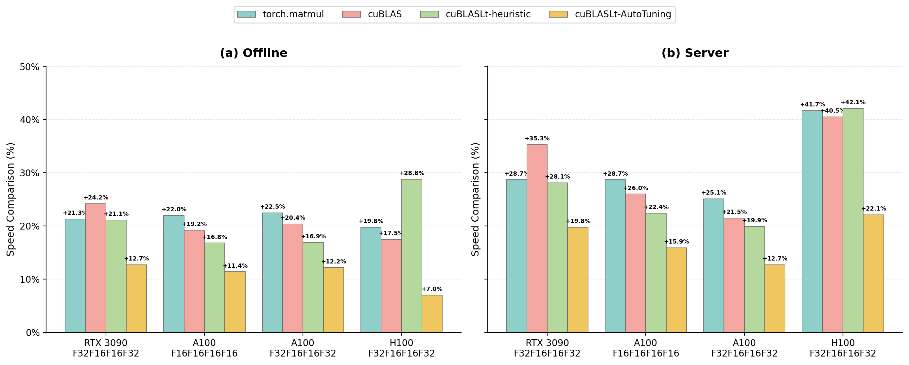

<hr>
<div align="center">
  <picture>
      
  </picture>
</div>


<h1 align="center" style="line-height: 1.3;">
CUDA-L2: Surpassing cuBLAS Performance for Matrix Multiplication through Reinforcement Learning
</h1>

<!-- -->

## 🥳 Introduction

**CUDA-L2** is a system that combines large language models (LLMs) and reinforcement learning (RL) to automatically optimize Half-precision General Matrix Multiply (HGEMM) CUDA kernels. CUDA-L2 systematically outperforms major matmul baselines to date, from the widely-used torch.matmul to state-of-the-art NVIDIA closed-source libraries (cuBLAS, cuBLASLt-heuristic, cuBLASLt-AutoTuning). <a href="https://arxiv.org/pdf/2512.02551">Paper</a>

<div align="center">
  
  <br>
  <em>Summary of CUDA-L2 speedup over baselines across all GPU configurations (RTX 3090-F32F16F16F32, A100-F16F16F16F16, A100-F32F16F16F32, H100-F32F16F16F32) in Offline and Server modes.</em>
</div>


## 🎉 What's New
- **[Mar 30, 2026]** Released H100 HGEMM (16 bit) kernels with 32-bit accumulator (F32F16F16F32).  🎉🎉🎉

  <div align="center">

  | Mode | vs torch.matmul | vs cuBLAS | vs cuBLASLt-heuristic | vs cuBLASLt-AutoTuning |
  |:----:|:---------------:|:---------:|:--------------------:|:----------------------:|
  | Offline | +19.8% | +17.5% | +28.8% | +7.0% |
  | Server | +41.7% | +40.5% | +42.1% | +22.1% |

  </div>

- **[Mar 23, 2026]** Released RTX 3090 HGEMM (16 bit) kernels with 32-bit accumulator (SM80_16x8x16_F32F16F16F32). 🎉🎉🎉

  <div align="center">

  | Mode | vs torch.matmul | vs cuBLAS | vs cuBLASLt-heuristic | vs cuBLASLt-AutoTuning |
  |:----:|:---------------:|:---------:|:--------------------:|:----------------------:|
  | Offline | +21.3% | +24.2% | +21.1% | +12.7% |
  | Server | +28.7% | +35.3% | +28.1% | +19.8% |

  </div>
- **[Jan 7, 2026]** Released 1,000 A100 HGEMM (16 bit) kernels with 32-bit accumulator (SM80_16x8x16_F32F16F16F32). 🎉🎉🎉
  <div align="center">

  | Mode | vs torch.matmul | vs cuBLAS | vs cuBLASLt-heuristic | vs cuBLASLt-AutoTuning |
  |:----:|:---------------:|:---------:|:--------------------:|:----------------------:|
  | Offline | +22.5% | +20.4% | +16.9% | +12.2% |
  | Server | +25.1% | +21.5% | +19.9% | +12.7% |

  </div>  
- **[Dec 2, 2025]** Released A100 optimized HGEMM (16 bit) kernels across 1,000 configurations with 16-bit accumulator (SM80_16x8x16_F16F16F16F16). 

  <div align="center">

  | Mode | vs torch.matmul | vs cuBLAS | vs cuBLASLt-heuristic | vs cuBLASLt-AutoTuning |
  |:----:|:---------------:|:---------:|:--------------------:|:----------------------:|
  | Offline | +22.0% | +19.2% | +16.8% | +11.4% |
  | Server | +28.7% | +26.0% | +22.4% | +15.9% |

  </div>

## 🗒️ To-Do List
- [x] Release HGEMM with 32-bit accumulator (F32F16F16F32 officially) for A100. 
- [x] Release HGEMM with 32-bit accumulator (F32F16F16F32 officially) for 3090.
- [x] Release HGEMM with 32-bit accumulator (F32F16F16F32 officially) for H100.
- [ ] Support denser matrix configurations (more configurations).
- [ ] Extend to more GPUs (Ada Lovelace, Hopper, Blackwell).
- [ ] Easy deployment for open-source LLMs.

## FAQ

**Q: Do A100 kernels apply to other machines like RTX 3090 or H100?**

A: Ideally, kernels trained on A100 should only be used on A100 if you are targeting speedup. They might have speedup on other machines, but it's not guaranteed. We will progressively release kernels trained on different machines.

**Q: What if I need matrix dimensions (M, N, K) not found in your configurations?**

A: 1. You can find the nearest neighbor configuration (larger than yours) and pad with zeros.
2. Feel free to post your dimensions on GitHub issues. We are happy to release kernels for your configuration.


## Installation & Setup

### 1\. Prerequisites

  * **Python**: Ensure you have a working Python environment.
  * **PyTorch**: This project requires PyTorch version **2.6.0** or higher.

### 2\. Clone CUTLASS

This project depends on NVIDIA CUTLASS. You must clone specific tag `v4.2.1` into a directory named `cutlass`:

```bash
git clone -b v4.2.1 https://github.com/NVIDIA/cutlass.git cutlass
```

> ⚠️ **Warning**: Please ensure you download the correct CUTLASS version (`v4.2.1`) and set the `CUTLASS_DIR` environment variable correctly. Incorrect CUTLASS setup may cause the project to fail silently or produce no results.

### 3\. Environment Variables

Before building or running the project, you must configure the following environment variables:

  * `CUTLASS_DIR`: Points to the directory where you cloned CUTLASS.
  * `TORCH_CUDA_ARCH_LIST`: Specifies the target GPU architecture (e.g., "8.0" for NVIDIA Ampere / A100 / RTX 30 series, "9.0a" for NVIDIA H100).

Run the following commands:

```bash
export CUTLASS_DIR=/path/to/your/cutlass
export TORCH_CUDA_ARCH_LIST="8.0"
# If you are using H100, use:
# export TORCH_CUDA_ARCH_LIST="9.0a"
```

## Usage

To run the evaluation, use the `eval_one_file.sh` script. Below is an example command for offline mode:

```bash
./eval_one_file.sh --mnk 64_4096_64 --acc_precise fp32 --device_type a100 --warmup_seconds 5 --benchmark_seconds 10 --base_dir ./results --gpu_device_id 7 --mode offline
```

For server mode, you need to specify `--target_qps`:

```bash
./eval_one_file.sh --mnk 64_4096_64 --acc_precise fp32 --device_type a100 --warmup_seconds 5 --benchmark_seconds 10 --base_dir ./results --gpu_device_id 7 --mode server --target_qps 100
```

### Arguments Reference

| Argument | Description |
| :--- | :--- |
| `--mnk` | Specifies the problem size (e.g., `64_4096_64`). |
| `--acc_precise` | Accumulator precision. Options are:<br>• `fp16`: 16-bit accumulator (F16F16F16F16).<br>• `fp32`: 32-bit accumulator (F32F16F16F32). |
| `--device_type` | Target GPU device type. Options are `a100` , `3090` or `h100`. |
| `--warmup_seconds` | Duration of warmup in seconds before timing. |
| `--benchmark_seconds` | Duration of benchmarking in seconds. |
| `--base_dir` | Directory to save the compile and output results. |
| `--gpu_device_id` | The ID of the GPU to use (e.g., `7`). |
| **`--mode`** | **Execution mode.** Options are:<br>• `offline`: Runs the evaluation in offline/batch processing mode.<br>• `server`: Runs the evaluation in server mode (simulating request-based scenarios). |
| `--target_qps` | Target Queries Per Second (QPS) for server mode. Required if mode is `server`. |


## 📇 Citation
```latex
@article{su2025cuda,
  title={CUDA-L2: Surpassing cuBLAS Performance for Matrix Multiplication through Reinforcement Learning},
  author={Su, Songqiao and Sun, Xiaofei and Li, Xiaoya and Wang, Albert and Li, Jiwei and Shum, Chris},
  journal={arXiv preprint arXiv:2512.02551},
  year={2025}
}
```


## ✉️ Contact
If you have any questions, please open a GitHub issue or reach out to us at **jiwei_li@deep-reinforce.com**.
